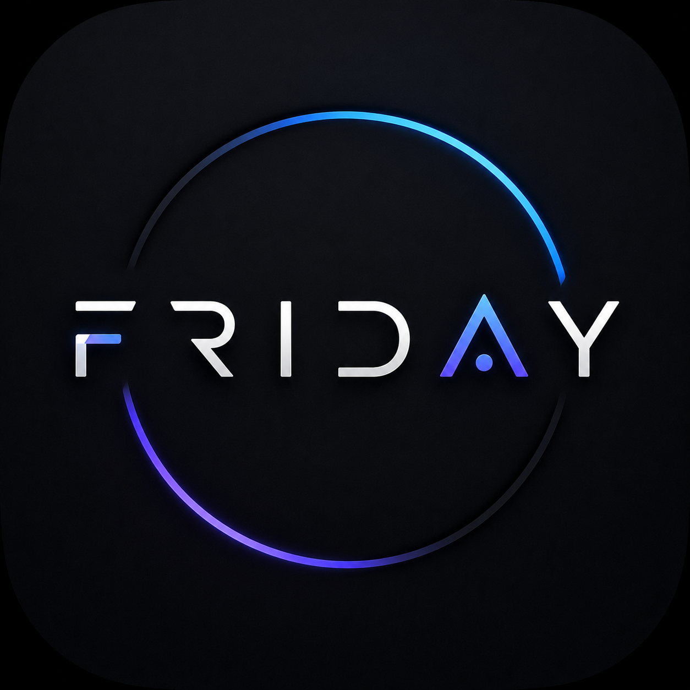
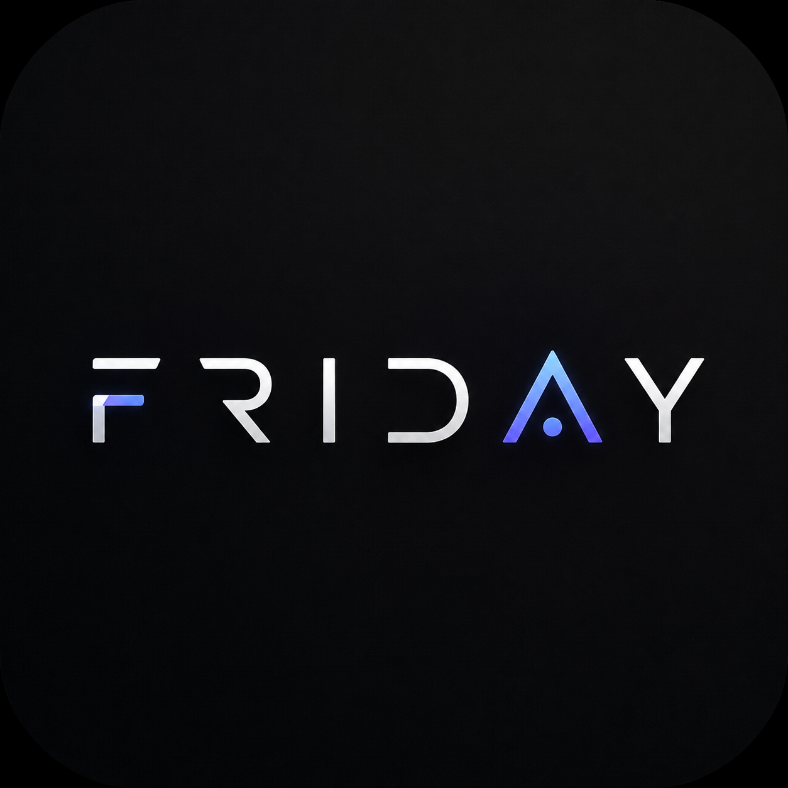

# FRIDAY — Autonomous Multimodal AI Desktop Agent

<p align="center">
  
  <br />
  
</p>

<p align="center">
  <strong>An intelligent, witty, real-time multimodal desktop AI companion built for Windows.</strong>
</p>

<p align="center">
  <a href="https://github.com/samprit874/FRIDAY/releases/tag/v1.0.0"></a>
  <a href="https://github.com/samprit874/FRIDAY/releases/latest"></a>
  <a href="LICENSE"></a>
  <a href="https://aistudio.google.com/"></a>
  <a href="https://github.com/samprit874"></a>
</p>

---

## 🌟 Overview

**FRIDAY** is a state-of-the-art desktop AI agent that seamlessly bridges cutting-edge Multimodal AI with deep Windows system automation. Powered by the **Google Gemini Multimodal Live API**, FRIDAY listens, speaks, watches your screen in real-time, remembers key facts about you across sessions, and autonomously controls your PC at blazing fast speeds.

---

## ✨ Key Features

- 🎙️ **Real-Time Voice AI (Gemini Live):** Ultra-low latency two-way voice streaming with interruptibility, emotional awareness, and natural conversation.
- 👁️ **Live Screen Vision:** Share your screen continuously at high FPS for real-time visual assistance, coding debugging, content analysis, and active guidance.
- 🧠 **Persistent Cognitive Memory:** Automatically extracts durable user facts, preferences, ongoing projects, and milestones into a local memory core.
- ⚡ **Native C# Fast Automation:** Sub-millisecond desktop control via high-performance native automation binaries:
  - `FastClick.exe` — Physical mouse click simulation.
  - `FastKeys.exe` — Focused keystrokes and typing injection.
  - `FastScreenCap.exe` — DirectX/GDI lightning screen capture.
  - `FastScroll.exe` — Smooth continuous wheel scrolling.
  - `FastUIA.exe` — UIAutomation accessibility tree inspector.
- 🎵 **System Media Automation:** Native Windows media controls for Spotify, YouTube, and global audio (play/pause, skip, volume, track info).
- 🔍 **Local Project & Codebase Indexer:** Built-in code indexing engine (`friday_project_index`) for fuzzy searching, symbol extraction, and workspace queries.
- 🤖 **Autonomous Python Sidecar Agent:** Python-powered executor for deep file manipulation, terminal tasks, and scheduled background cron jobs.
- 🛡️ **100% Privacy & Local Control:** Your API keys, memories, and personal data remain stored strictly on your local PC.

---

## 🏛️ System Architecture

```
┌─────────────────────────────────────────────────────────────┐
│                    FRIDAY Desktop Client                    │
│      (Electron Shell + React 19 UI + Tailwind + Motion)     │
└──────────────────────────────┬──────────────────────────────┘
                               │
               WebSocket / HTTP (localhost:3000)
                               │
┌──────────────────────────────▼──────────────────────────────┐
│                   FRIDAY Node.js Backend                    │
│      (@google/genai Live WebSocket + Tool Routing Engine)   │
└──────────────┬──────────────────────────────┬───────────────┘
               │                              │
     Tool Dispatch & Automation       AI Audio / Video Stream
               │                              │
 ┌─────────────▼─────────────┐   ┌────────────▼──────────────┐
 │  Native C# Binaries &     │   │   Google Gemini Live API  │
 │  Python Agent Sidecar     │   │  (gemini-2.0-flash-exp /   │
 │  (Desktop Automation)     │   │   gemini-2.5-flash)       │
 └───────────────────────────┘   └───────────────────────────┘
```

---

## 🚀 Quick Start & Installation

### Option 1: Running the Pre-Built Application
1. Download or clone this repository to your Windows PC:
   ```bash
   git clone https://github.com/samprit874/FRIDAY.git
   ```
2. Double-click **`FRIDAY.exe`** in the root folder.
3. On first launch, the **Setup Wizard** will appear.
4. Paste your **Google Gemini API Key** (get one free at [Google AI Studio](https://aistudio.google.com/app/apikey)).
5. Click **Continue** — FRIDAY is ready to awaken!

---

### Option 2: Running from Source (Development)
1. Ensure **Node.js (v18+)** and **Python (3.10+)** are installed.
2. Navigate to the app directory:
   ```bash
   cd resources/app
   npm install
   ```
3. Create your configuration from the template:
   ```bash
   cp secrets.json.example secrets.json
   ```
   Add your `geminiApiKey` in `secrets.json`.
4. Start the backend:
   ```bash
   npm start
   ```

---

## ⚙️ Configuration & Settings

Settings are stored in `resources/app/settings.json` or in your user AppData directory (`%APPDATA%\FRIDAY\settings.json`):

```json
{
  "autoStartMic": true,
  "wakeWordEnabled": true,
  "wakePhrase": "hey friday",
  "sensitivity": 60,
  "mediaControlEnabled": true,
  "mediaPreferredApp": "Spotify",
  "voiceName": "Achernar",
  "chromeProfile": "Default"
}
```

### Supported Multi-LLM Providers (Optional)
In addition to Google Gemini, FRIDAY supports optional auxiliary providers in `secrets.json`:
- **Groq** (`groqApiKey`)
- **xAI / Grok** (`xaiApiKey`)
- **DeepSeek** (`deepseekApiKey`)
- **OpenRouter** (`openrouterApiKey`)
- **NVIDIA NIM** (`nvidiaApiKey`)
- **Mistral** (`mistralApiKey`)

---

## 🔒 Security & Privacy

- **No Secrets in Repo:** Never commit `secrets.json`, `.env`, or memory files to Git.
- **Local Storage:** All memories, conversation histories, and settings are saved locally on your device.
- **Microphone & Screen Privacy:** Screen capture and microphone streams only transmit while the session is actively connected.

---

## 👨‍💻 Creator & Attribution

FRIDAY was created and architected by **[Samprit Sarkar](https://github.com/samprit874)**.

- **GitHub:** [@samprit874](https://github.com/samprit874)
- **Project:** [https://github.com/samprit874/FRIDAY](https://github.com/samprit874/FRIDAY)

---

## 📄 License

This project is licensed under the **MIT License** — see the [LICENSE](LICENSE) file for details.
